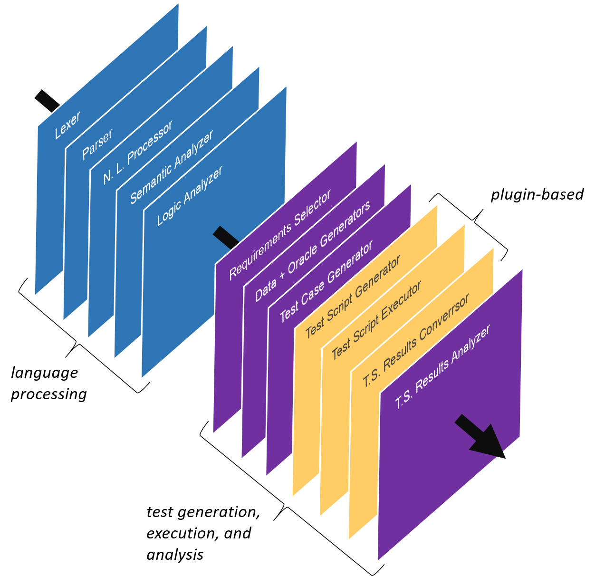

# Concordia

> Generate functional tests automatically from your Agile specification.

[](https://travis-ci.org/thiagodp/concordialang)
[](https://badge.fury.io/js/concordialang)
[](https://github.com/thiagodp/concordialang/blob/master/LICENSE.txt)
[](https://concordialang.slack.com)

Translations: [Português](readme-pt.md) 🌎

*Concordia* is a tool that allows you to generate functional tests from a requirements specification written in *Concordia Language*.  You can use them for:

1. Writing [business-readable](https://martinfowler.com/bliki/BusinessReadableDSL.html) specifications.

2. Generating and executing [functional test cases](https://en.wikipedia.org/wiki/Functional_testing) automatically. *No just test script skeletons!* It generates complete test cases and test scripts - with *test data* and *oracles*. You don't even need to know how to write code!

3. Generating test scripts for different testing frameworks, such as [CodeceptJS](https://codecept.io/), through [plug-ins](plugins/README.md).

4. Write additional test cases when needed, using *Concordia Language* - currently available in **English** (`en`) and **Portuguese** (`pt`). These test cases are converted to test scripts using plugins.

5. Analyze test results to help evaluating failures.

*Concordia Language* is an [Agile](https://en.wikipedia.org/wiki/Agile_software_development) requirements specification metalanguage inspired in [Gherkin](https://github.com/cucumber/cucumber/wiki/Gherkin).


## Contents

- [Why Concordia](#why-concordia)
- [Install](#install)
- [Execution](#execution)
- [Examples](#examples)
- [Language syntax](#language-syntax)
- [CLI](#cli)
- [Recommended usage cycle](#recommended-usage-cycle)
- [How it works](#how-it-works)
- [Generated test cases](#generated-test-cases)
- [Contributing to Concordia](#contributing-to-concordia)

## Why Concordia ?

- Simple [syntax](docs/language/en.md)

- No need to write code

- Separate high-level, **business language** declarations from medium-low-level, **computing language** declarations

- Have complete and relevant tests in few seconds

- High coverage of business rules at a small declaration effort

- Let you describe complex, dynamic business rules, including those related to data from databases

- Have test cases declared in a high-level language

- Create additional test cases without coding

- Generated test cases and test scripts receive comments with related specification, so you can track them

- Available in more than one spoken language

- No special text editor required - use your favorite UTF-8 editor

- Use your favorite [version control system](https://en.wikipedia.org/wiki/Version_control) to manage changes

- Batteries included (install and use)


## Install

Concordia requires [NodeJS](https://nodejs.org/) version `8` or above. After NodeJS is installed, run the following command:
```bash
npm install -g concordialang
```

You can test the installation as follows:
```bash
concordia --version
```
Whether a version number is displayed, the installation was successful.

### Installing a plugin

List the available plugins:
```bash
concordia --plugin-list
```

Then install the desired one. For instance:
```bash
concordia --plugin-install codeceptjs
```

Concordia and its plug-ins install all the needed dependencies by default, in order to make the setup process simpler.


## Execution

### Starting a testing server

Sometimes when we run tests against a user interface, it is needed to control the execution through a testing server. For instance, `CodeceptJS` may have to use a `Selenium` server to control the execution of tests for web applications. Without such server, it is not able to work.

Run the following command to start a testing server:

```bash
concordia --plugin-serve <plugin-name>
```

After the server is started, you probably have to run Concordia in another terminal (console).

### Running Concordia 🚀

```bash
concordia path/to/your/features --plugin <plugin-name>
```

Or just go the directory of your features and inform the desired plugin. Example:
```bash
concordia --plugin codeceptjs
```

### Stopping a testing server

It is likely that your testing server remain open after executing all the tests.

Type `Ctrl + C` to close it.


## Examples

### A very simple example

> *Example without test data generation, test scenario combination, or most language capabilities.*

**Input**

`search.feature` :
```gherkin
Feature: Google Search

Scenario: Search returns expected result

  Variant: Search content on pressing Enter
    Given that I am on "https://google.com"
    When I type "concordialang.org" in <q>
      And I press "Enter"
    Then I see "npm"
```
**Run**

Start the test server (once)
```bash
$ concordia --plugin-serve codeceptjs
```
Generate and run
```bash
$ concordia --plugin codeceptjs
```

**Output**

`search.testcase` :
```gherkin
# Generated with ❤ by Concordia
#
# THIS IS A GENERATED FILE - MODIFICATIONS CAN BE LOST !

import "search.feature"

@generated
@scenario(1)
@variant(1)
Test case: Search content on pressing Enter - 1
  Given that I am on "https://google.com"
  When I type "concordialang.org" in <q>
    And I press "Enter"
  Then I see "npm"
```

`search.js` :
```javascript
// Generated with ❤ by Concordia
// source: search.testcase
//
// THIS IS A GENERATED FILE - MODIFICATIONS CAN BE LOST !

Feature("Google Search");

Scenario("Search returns expected result | Search content on pressing Enter - 1", (I) => {
    I.amOnPage("https://google.com"); // (10,5)
    I.fillField("q", "concordialang.org"); // (11,5)
    I.pressKey("Enter"); // (12,7)
    I.see("npm"); // (13,5)
});
```

and it will also **run the tests**.


### Another example

> *Example with generation of test cases and test data, but without the combination of test scenarios and states.*

See [this example](docs/example.md) to get a better overview of the Concordia Language and its usage. 👀

### Detailed example

> *Soon we will add here an example that explores most of Concordia features*


## Language syntax

- [English](docs/language/en.md)
- [Português](docs/language/pt.md)


## CLI

```
concordia --help

  Concordia Language Compiler

  Usage: concordia [<dir>] [options]

  where <dir> is the directory that contains your specification files.

  Options:

  Input directories and files

  -d,  --directory <value>               Directory to search.
  -nr, --no-recursive                    Disable recursive search.
  -e,  --encoding <value>                File encoding. Default is "utf8".
  -x,  --extensions <".ext1,.ext2,...">  File extensions to consider (when <dir> is informed).
  -i,  --ignore <"file1,file2,...">      Files to ignore, when <dir> is informed.
  -f,  --files <"file1,file2,...">       Files to consider, instead of <dir>.

  -l,  --language <code>                 Default language. Default is "en" (english).
  -ll, --language-list                   List available languages.

  Plug-in

  -p,  --plugin <name>                   Plug-in to use.
  -pa, --plugin-about <name>             About a plug-in.
  -pi, --plugin-install <name>           Install a plug-in.
  -pu, --plugin-uninstall <name>         Uninstall a plug-in.
  -ps, --plugin-serve <name>             Starts a test server with a plugin.
  -pl, --plugin-list                     List available plug-ins.

  Processing and output

  --save-config                          Save/overwrite a configuration file
                                         with the other command line options.

  -b,  --verbose                         Verbose output.

  -np, --no-spec                         Do not process specification files.
  -nt, --no-test-case                    Do not generate test cases.
  -ns, --no-script                       Do not generate test scripts.
  -nx, --no-run                          Do not run test scripts.
  -nu, --no-result                       Do not process execution results.

  -jp, --just-spec                       Just process specification files.
  -jt, --just-test-case                  Just generate test cases.
  -js, --just-script                     Just generate test scripts.
  -jx, --just-run                        Just execute test scripts.

  -dt, --dir-test-case                   Output directory for test cases.
  -ds, --dir-script                      Output directory for test scripts.
  -du, --dir-result                      Output directory for result files.

  -ef, --ext-feature                     File extension for Feature files.
                                         Default is .feature.
  -et, --ext-test-case                   File extension for Test Case files.
                                         Default is .testcase.
  -lb, --line-breaker                    Character used for breaking lines.

  Content generation

  --case-ui (camel|pascal|snake|kebab|none)
                                         String case to use for UI Element names
                                         when they are not defined (default is camel).
  --case-method (camel|pascal|snake|kebab|none)
                                         String case to use for test script methods
                                         (default is snake).
  --tc-suppress-header                   Suppress header in generated Test Case files.
  --tc-indenter <value>                  String used as indenter in generated Test Case
                                         files (default is double spaces).

  Randomic value generation

  --seed <value>                         Use the given random seed. Default is current
                                         date and time.
  --random-min-string-size <number>      Minimum random string size. Default is 0.
  --random-max-string-size <number>      Minimum random string size. Default is 500.
  --random-tries <number>                Random tries to generate invalid values.
                                         Default is 5.

  Combination strategies

  --comb-variant (random|first|fmi|all)  Strategy to select variants to combine,
                                         by their states.
        random  = random variant that has the state (default)
        first   = first variant that has the state
        fmi     = first most important variant that has the state
        all     = all variants that have the state

  --comb-state (sre|sow|onewise|all)     Strategy to combine states of a
                                         same variant.
        sre     = single random of each (default)
        sow     = shuffled one-wise
        ow      = one-wise
        all     = all

  --comb-invalid (node|0|1|smart|random|all)
                                         How many input data will be invalid
                                         in each test case.
        0,none  = no invalid data
        1       = one invalid data per test case
        smart   = use algorithm to decide (default)
        random  = random invalid data per test case
        all     = all invalid

  --comb-data (sre|sow|onewise|all)     Strategy to combine data test cases
                                        of a variant.
        sre     = single random of each (default)
        sow     = shuffled one-wise
        ow      = one-wise
        all     = all

  Information

  -v,  --version                         Show current version.
  -a,  --about                           Show information about this application.
  -h,  --help                            Show this help.

  Examples

   $ concordia --plugin some-plugin
   $ concordia path/to/dir --no-test-case --no-script -p some-plugin
   $ concordia --files "file1.feature,path/to/file2.feature" -p some-plugin -l pt
```


## Recommended usage cycle

1. Write or update your requirements specification with the *Concordia Language* and validate it with users or stakeholders;

2. Use *Concordia* to generate tests from the specification and to run them;

3. If the tests **failed**, there are some possibilities:

    1. You still haven't implemented the corresponding behavior in your application. In this case, just implement it and run the tests again.

    2. Your application is behaving differently from the specification. In this case, it may have bugs or you or your team haven't implemented the behavior exactly like described in the specification.   - Whether the application has a bug, we are happy to have discovered it! Just fix it and run the tests again to make sure that the bug is gone.
      - Otherwise, you can decide between **changing your application** to behave exactly like the specification describes, or **changing the specification** to match your application behavior. In the latter case, back to step `1`.

4. If the tests **passed**, *great job!* Now you can write new requirements or add more test cases, so just back to step `1`.


## How it works



1. Concordia reads your `.feature` and `.testcase` files like a compiler, and uses a [lexer](https://en.wikipedia.org/wiki/Lexical_analysis) and a [parser](https://en.wikipedia.org/wiki/Parsing#Computer_languages) to identify and check documents' structure.

2. Concordia uses basic [Natural Language Processing](https://en.wikipedia.org/wiki/Natural-language_processing) (NLP) to identify sentences' [intent](http://mrbot.ai/blog/natural-language-processing/understanding-intent-classification/). This increases the chances of recognizing sentences written in different styles.

3. Concordia performs [semantic analysis](https://en.wikipedia.org/wiki/Semantic_analysis_(compilers)) to check recognized declarations.

4. Concordia uses the specification to infer the most suitable *test cases*, *test data*, and *test oracles*, and then generates `.testcase` files in Concordia Language, a kind of *restricted natural language*.

5. Concordia transforms all the test cases into test scripts (that is, source code) using a plug-in.

6. Concordia executes the test scripts with the plug-in. These test scripts will check your application's behavior through its user interface.

7. Concordia reads and presents execution results. These results relate failing tests to the specification, in order to help you understanding the possible reasons of a failure.


## Generated test cases

Concordia can generate test cases from [functional requirements](https://en.wikipedia.org/wiki/Functional_requirement) written in Concordia Language. Although it is not able to generate test cases for [non-functional requirements](https://en.wikipedia.org/wiki/Non-functional_requirement) automatically, you can create them manually with traditional *Behavior-Driven Development* (BDD) tools based on [Gherkin](https://github.com/cucumber/cucumber/wiki/Gherkin), such as [Cucumber](https://docs.cucumber.io/).

### Covered states

> *description soon*

### Covered scenarios

> *description soon*

### Covered rules

Every input data may receive values according to its business rules.
These business rules are classified in the following groups:
`VALUE`, `LENGTH`, `FORMAT`, `SET`, `REQUIRED`, and `COMPUTED`.
All but `COMPUTED` are currently available.

Every group has related test cases, applied according to the declared business rules:

```
+----------+--------------------------------+
| group    | testcase                       |
|----------|--------------------------------|
| VALUE    | LOWEST_VALUE                   |
|          | RANDOM_BELOW_MIN_VALUE         |
|          | JUST_BELOW_MIN_VALUE           |
|          | MIN_VALUE	                    |
|          | JUST_ABOVE_MIN_VALUE           |
|          | ZERO_VALUE	                    |
|          | MEDIAN_VALUE                   |
|          | RANDOM_BETWEEN_MIN_MAX_VALUES  |
|          | JUST_BELOW_MAX_VALUE           |
|          | MAX_VALUE	                    |
|          | JUST_ABOVE_MAX_VALUE           |
|          | RANDOM_ABOVE_MAX_VALUE         |
|          | GREATEST_VALUE                 |
| LENGTH   | LOWEST_LENGTH                  |
|          | RANDOM_BELOW_MIN_LENGTH        |
|          | JUST_BELOW_MIN_LENGTH          |
|          | MIN_LENGTH                     |
|          | JUST_ABOVE_MIN_LENGTH          |
|          | MEDIAN_LENGTH                  |
|          | RANDOM_BETWEEN_MIN_MAX_LENGTHS |
|          | JUST_BELOW_MAX_LENGTH          |
|          | MAX_LENGTH	                    |
|          | JUST_ABOVE_MAX_LENGTH          |
|          | RANDOM_ABOVE_MAX_LENGTH        |
|          | GREATEST_LENGTH                |
| FORMAT   | VALID_FORMAT                   |
|          | INVALID_FORMAT                 |
| SET      | FIRST_ELEMENT                  |
|          | RANDOM_ELEMENT                 |
|          | LAST_ELEMENT                   |
|          | NOT_IN_SET                     |
| REQUIRED | FILLED                         |
|          | NOT_FILLED                     |
| COMPUTED | RIGHT_COMPUTATION	            |
|          | WRONG_COMPUTATION	            |
+----------+--------------------------------+
```

### Example 1

Let's describe a rule for a user interface element `Salary` :

```gherkin
UI Element: Salary
  - data type is double
```

Since few restrictions were made, `Salary` will be tested with the test cases of the group `REQUIRED`:
1. `FILLED`: a *pseudo-random* double value will be generated
2. `NOT_FILLED`: an empty value will be used

Now let's add a **minimum value** restriction.

```gherkin
UI Element: Salary
  - data type is double
  - minimum value is 1000.00
    Otherwise I must see "Salary must be greater than or equal to 1000"
```

Some tests of the group `VALUE` are now applicable:

1. `LOWEST_VALUE`: the lowest possible double is used
2. `RANDOM_BELOW_MIN_VALUE`: a random double before the minimum value is generated
3. `JUST_BELOW_MIN_VALUE`: a double just below the minimum value is used (*e.g.*, `999.99`)
4. `MIN_VALUE`: the minimum value is used
5. `JUST_ABOVE_MIN_VALUE`: a double just above the minimum value is used (*e.g.*, `1000.01`)
6. `ZERO_VALUE`: zero (`0`) is used

Since `1000.00` is the minimum value, the data produced by the tests `1`, `2`, `3`, and `6` of the group `VALUE` are considered **invalid**, while `4` and `5` are not. For these tests considered **invalid**, the behavior defined in `Otherwise`, that is
```gherkin
    Otherwise I must see "Salary must be greater than or equal to 1000"
```
is expected to happen. In other words, this behavior serves as [test oracle](https://en.wikipedia.org/wiki/Test_oracle) and must occur only when the produced value is invalid.

Unlike this example, when the expected system behavior for invalid values is not specified and a test data is considered **invalid**, Concordia expects that test should **fail**. In this case, it generates the Test Case with the tag `@fail`.

Now let's add **maximum value** restriction:

```gherkin
UI Element: Salary
  - data type is double
  - minimum value is 1000.00
    Otherwise I must see "Salary must be greater than or equal to 1000"
  - maximum value is 30000.00
    Otherwise I must see "Salary must be less than or equal to 30000"
```

All the tests of the group `VALUE` are now applicable. That is, the following tests will be included:

1. `MEDIAN_VALUE`: the median between the minimum and the maximum values
2. `RANDOM_BETWEEN_MIN_MAX_VALUES`: a pseudo-random double value between the minimum and the maximum values
3. `JUST_BELOW_MAX_VALUE`: the value just below the maximum value
4. `MAX_VALUE`: the maximum value
5. `JUST_ABOVE_MAX_VALUE`: the value just above the maximum value
6. `RANDOM_ABOVE_MAX_VALUE`: a pseudo-random double above the maximum value
7. `GREATEST_VALUE`: the greatest possible double

The tests from `5` to `7` will produce values considered **invalid**.

### Example 2

Let's define a user interface element named `Profession` and a table named `Professions` from which the values come from:

```gherkin
UI Element: Profession
  - type is select
  - value comes from "SELECT name from [Professions]"
  - required is true

Table: Professions
  | name       |
  | Lawyer     |
  | Accountant |
  | Dentist    |
  | Professor  |
  | Mechanic   |
```

Applicable test are:
  - `FILLED`
  - `NOT_FILLED`
  - `FIRST_ELEMENT`
  - `RANDOM_ELEMENT`
  - `LAST_ELEMENT`
  - `NOT_IN_SET`

The first two tests are in the group `REQUIRED`. Since we declared `Profession` as having required value, the test `FILLED` is considered **valid** but `NOT_FILLED` isn't. It's important to remember declaring required inputs accordingly.

The last four tests are in the group `SET`. Only the last one, `NOT_IN_SET`, will produce a value considered **invalid**.

### Example 3

In this example, let's adjust the past two examples to make `Salary` rules *dynamic*, and change according to the `Profession`.

Firstly, we'll add two columns the the `Professions` table:

```gherkin
Table: professions
  | name       | min_salary | max_salary |
  | Lawyer     | 100000     |  900000    |
  | Accountant |  90000     |  800000    |
  | Dentist    | 150000     |  900000    |
  | Professor  |  80000     |  500000    |
  | Mechanic   |  50000     |  120000    |
```

Then, we'll change the rules to retrieve the values from the table:

```gherkin
UI Element: Salary
  - data type is double
  - minimum value comes from the query "SELECT min_salary FROM [Professions] WHERE name = {Profession}"
    Otherwise I must see "The given Salary is less than the minimum value"
  - maximum value comes from the query "SELECT max_salary FROM [Professions] WHERE name = {Profession}"
    Otherwise I must see "The given Salary is greater than the maximum value"
```

The reference to the UI Element `{Profession}` inside the query, makes the rules of `Salary` depend on `Profession`. Every time a `Profession` is selected, the **minimum value** and the **maximum value** of `Salary` changes according to the columns `min_salary` and `max_salary` of the table `Professions`.


## Contributing to Concordia

- [How to contribute](contributing.md)
- [Create a plug-in](plugins/README.md)
- [Improve the documentation](https://github.com/thiagodp/concordialang#fork-destination-box)
- [Report a bug](https://github.com/thiagodp/concordialang/issues/new)
- [Suggest a feature or change](https://github.com/thiagodp/concordialang/issues/new)
- [Develop it with us](docs/development.md)
- [Donate](docs/donate.md)

*There are lot of ways to contribute. Many of them are a piece of cake!* 😉

- Spread
  - *Talk to your friends* - their feedback will help us too!
  - *Give it a star* - ⭐ People that follows you will know about it
- Use it and tell us
  - *[Chat](https://concordialang.slack.com) with us* - Did you like it? Did you have any doubts?
  - *Try it on your company* - Tell us which results did you get!
- Improve the documentation
  - *[Report](https://github.com/thiagodp/concordialang/issues/new) typos*
  - *Extend it* - send us the file or create a [fork](https://github.com/thiagodp/concordialang#fork-destination-box) and submit a *[pull request](https://help.github.com/articles/about-pull-requests/)*
  - *Translate* - send us the file or create a [fork](https://github.com/thiagodp/concordialang#fork-destination-box) and submit a *[pull request](https://help.github.com/articles/about-pull-requests/)*
- [Create a plug-in](plugins/README.md)
- [Report a bug](https://github.com/thiagodp/concordialang/issues/new)
- [Suggest a new feature or a change](https://github.com/thiagodp/concordialang/issues/new)
- [Develop it with us](docs/development.md)


## License

 © [Thiago Delgado Pinto](https://github.com/thiagodp)

[GNU Affero General Public License version 3](LICENSE.txt)
